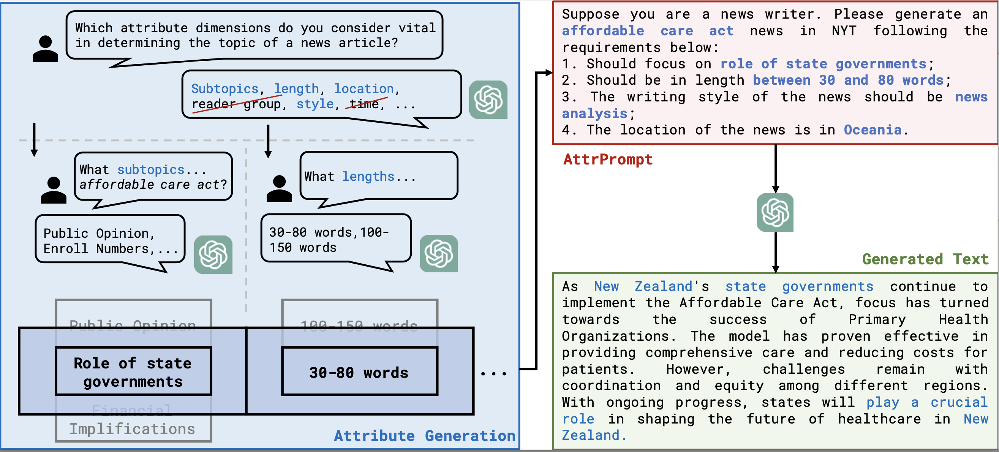

# AttrPrompt
This repo contains the code and dataset used in the paper [Large Language Model as Attributed Training Data Generator: A Tale of Diversity and Bias](). 
It also provides a common and easy framework for development and evaluation of your own weak supervision models within the benchmark.

## Framework

## Dataset
### Generated Datasets
The datasets, including the original train/valiation/test data, the generated training data, as well as label names are available in Huggingface Dataset Hub:
| Dataset | # Train | # Test | # Class | Task  | Domain | Link | 
| ------  | ------- | ----- | ----------- | ----------- | ----------- | ----------- |
|  NYT | 9k | 1.15k | 26 | Multiclass | News | [nyt-attrprompt](https://huggingface.co/datasets/yyu/nyt-attrprompt)
| Amazon | 13.8k | 1.1k | 23 | Multiclass | Review |  [amazon-attrprompt](https://huggingface.co/datasets/yyu/amazon-attrprompt)
| Reddit | 27k | 2.3k | 45 |Multiclass | Social Media | [reddit-attrprompt](https://huggingface.co/datasets/yyu/reddit-attrprompt)
| StackExchange | 27k | 2.5k | 50 | Multiclass | Web Forum | [stackexchange-attrprompt](https://huggingface.co/datasets/yyu/stackexchange-attrprompt)
| arXiv | 26.1k | 27.8k | 98 | Multilabel | Paper | [arxiv-attrprompt](https://huggingface.co/datasets/yyu/arxiv-attrprompt)

Besides, we also provide the generated dataset for the AG News, SST-2/IMDB, Yelp, which is studied in Appendix. The detailed information is listed as follows:
| Dataset | # Train | # Test | # Class | Task  | Domain | Link | 
| ------  | ------- | ----- | ----------- | ----------- | ----------- | ----------- |
|  AG News | 6k | 7.6k | 4 | Multiclass | News | [agnews-attrprompt](https://huggingface.co/datasets/yyu/agnews-attrprompt)
| SST-2 | 6k | 0.8k | 2 | Multiclass | Movie Review |  [SST-2-attrprompt](https://huggingface.co/datasets/yyu/SST-2-attrprompt)
| Yelp | 6k | 38k | 2 |Multiclass | Restaurant Review | [yelp-attrprompt](https://huggingface.co/datasets/yyu/yelp-attrprompt)

###  Dataset Attributes
Coming soon ...

## Code for Training Data Generation
Coming soon...

## Code for Classifier Training
Coming soon...

## Questions?
Feel free to reach out to `yueyu at gatech.edu` for any questions regarding this repo. Please try to specify the problem with details so we can help you better and quicker!

## Citation
Coming soon...